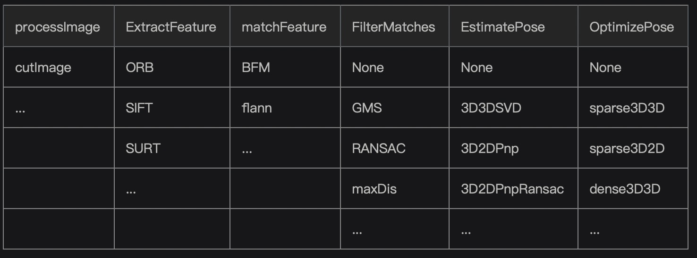
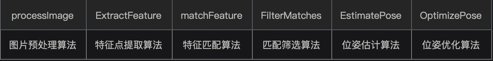

# FarStructure简介

FarStructure是一套针对“大间隔”“有序”帧的简易三维重建框架。

大间隔是指相邻两帧位姿差异较大\(相邻帧旋转角度&gt;15°，重合面积&lt;80%时\)，当遇到上述大间隔问题时，常规三维重建算法会失效\(目前实际只测量了infiniTAM算法\)，故提出了FarStructure算法，希望能够针对大间隔问题给出解决方案。

有序是指已知各帧的时空顺序，其中时间顺序是指各帧的拍摄时间先后顺序已知，空间顺序是指各帧位姿的旋转顺序已知且固定\(顺时针或逆时针\)

目前FarStructure算法已经基本完成Vision Odometry部分，且具有以下特点：

## 1. 针对大间隔

相比于连续帧，大间隔“帧间特征匹配质量”下降严重。为解决这一问题，本算法使用了一种基于统计规律的特征匹配过滤算法GMS，有效的提升了大间隔情况下“帧间特征匹配质量”。

另外，考虑到大间隔帧间重合度较低导致的错误匹配，本算法通过适当的图片裁剪技术进行优化，也取得了不错的效果。

## 2. 针对纹理缺失

考虑实际场景纹理缺乏导致特征匹配失效的情况，本算法提出了针对性的解决方案：首先通过AR交互方式获取先验位姿，其次利用先验位姿进行重投影获取弱旋转相邻帧，最后利用ICP等纹理无关技术进行帧间配准，进而获得相机位姿。

注：此方案正在完成中

## 2. 算法模块化

为了方便算法各部分的组合调试，本算法将整个三维重建\(目前仅有视觉里程计\)处理流程拆解成若干独立模块，每个模块均可自由选择具体的实现算法，例如”ExtractFeature“模块可选择的具体实现算法有：ORB，SIFT，SUFT。这样做的好处是方便进行算法组合测试，也便于添加新的算法。

具体拆分结构如下：（未来会根据需要继续添加新的模块或向每个模块添加更多算法） 

| processImage | ExtractFeature | matchFeature | FilterMatches | EstimatePose | OptimizePose |
| :--- | :--- | :--- | :--- | :--- | :--- |
| cutImage | ORB | BFM | None | None | None |
| ... | SIFT | flann | GMS | 3D3DSVD | sparse3D3D |
|  | SURT | ... | RANSAC | 3D2DPnp | sparse3D2D |
|  | ... |  | maxDis | 3D2DPnpRansac | dense3D3D |
|  |  |  | ... | ... | ... |

## 3. 数据与算法分离

为方便与其他算法快速融合\(例如将本算法Vision Odometry融入到infiniTAM算法中\),本算法将数据结构与算法分离：本算法的所有的算法接口\(主要在algo和object文件夹下\)均不依赖本算法的数据结构\(主要在object文件夹下\)，即只要配置好环境依赖，所有算法接口可直接调用。

* algo主要内容：核心流程算法

 

| processImage | ExtractFeature | matchFeature | FilterMatches | EstimatePose | OptimizePose |
| :---: | :---: | :---: | :---: | :---: | :---: |
| 图片预处理算法 | 特征点提取算法 | 特征匹配算法 | 匹配筛选算法 | 位姿估计算法 | 位姿优化算法 |

* tool主要内容：工具算法

| math | cloud | image | match |
| :---: | :---: | :---: | :---: |
| 数学类 | 点云类 | 图片类 | 匹配类 |

* object主要内容：数据结构

| Camera | Frame | Feature | Match | Map |
| :---: | :---: | :---: | :---: | :---: |
| 管理相机数据 | 管理每一帧数据 | 管理每一帧的特征点数据 | 管理相邻两帧特征匹配结果 | 管理全局点云 |

## 4. CreatFrame机制

大间隔有序帧重建过程中，位姿计算非常重要，为了能够准确且定量评估位姿计算结果，特设立CreatFrame机制，即第当前帧是由前一帧经过预定义空间变换得到，而非实际拍摄得到，这样预定义空间变换即为可作为定量评估依据的理论相对位姿，进而可准确且定量的评估位姿计算结果，方便调试及优化算法。

